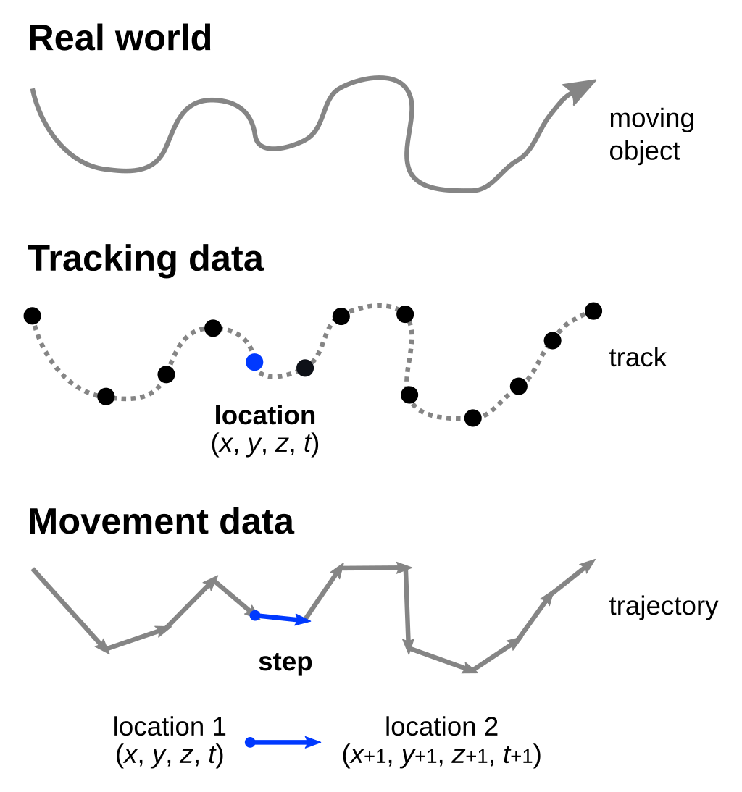
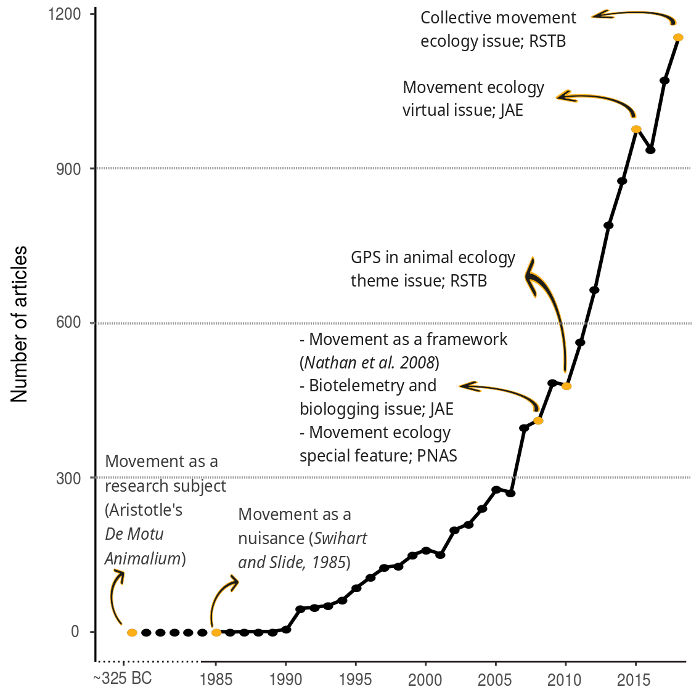
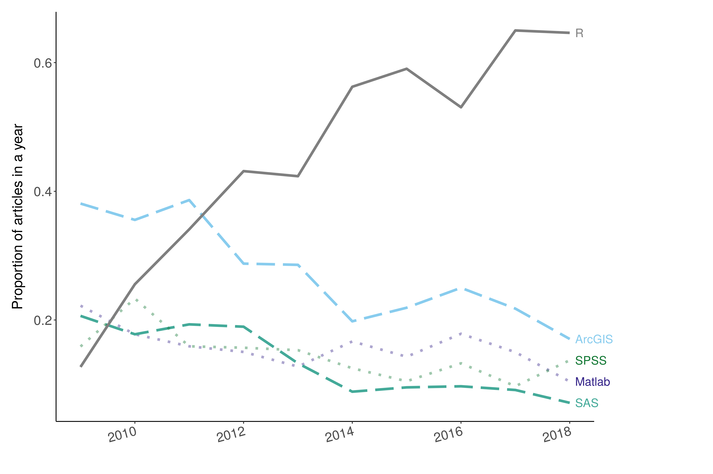
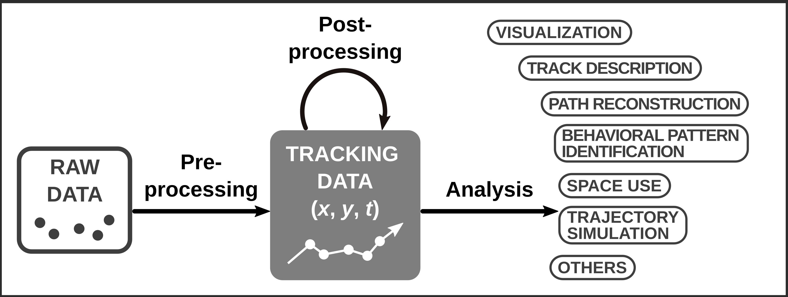
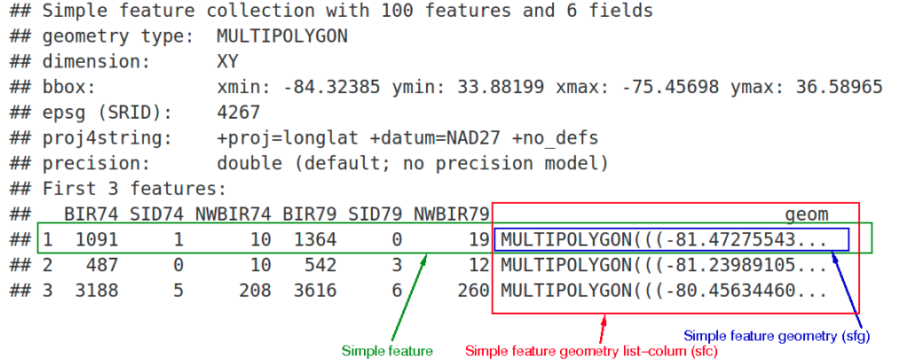
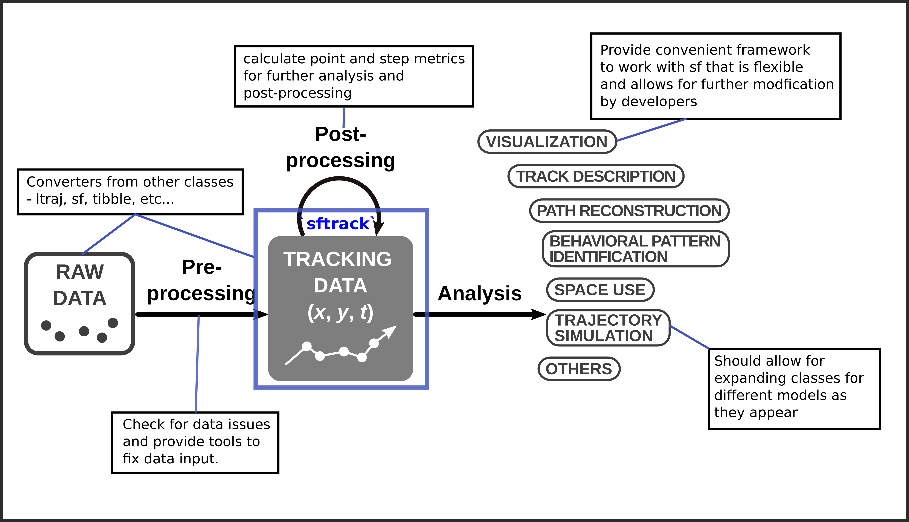
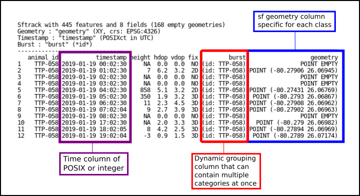

Introducing sftrack: A framework for movement data in R
========================================================
author: Matthew Boone, Rocio Joo, Mathieu Basille
date: Ecology Society of America conference 2020
css: esa.css
width: 1440
height: 900
History of movement data
========================================================
type: section
left: 40%
<br>
- Tracking data 
 + discrete points
 + home range analysis, resource selection functions, etc...
- Movement data
 + series of steps
 + Hidden-Markov Models, step selection functions, etc...

<!-- Important to understand that there could be gaps anywhere in the data -->
<!-- Maybe change graph to include missing points-->
***

<div align="center" style="margin-top: 50px">

</div>

History of movement data
========================================================
type: section
left: 45%
<br>

- Proliferation of study in the last 20 years.
- Devices: gps, satellite, accelerometer, light loggers, cameras, telemetry, etc...
- Data sizes increasing rapidly with more sensors

<div class='footer' style="font-size:15px; line-height:15px;">
<sup style="font-size:50%;">fig</sup>Joo, R., Picardi, S., Boone, M., Clay, T., Patrick, S., Romero-Romero, V., Basille, M., A Decade of Movement Ecology, 2020.<a href='https://arxiv.org/abs/2006.00110v1'> arXiv:2006.00110 </a>    
</div>
***


History of Movement Data in R
========================================================
type: section
title: FALSE
<h2 align="center"> Software used in the field of Movement Ecology</h2>
<div align="center" style="margin-top:0px">

</div>

<div class='footer' style="font-size:15px; line-height:15px;">
<sup style="font-size:50%;">1</sup>Joo, R., Picardi, S., Boone, M., Clay, T., Patrick, S., Romero-Romero, V., Basille, M., A Decade of Movement Ecology, 2020.<a href='https://arxiv.org/abs/2006.00110v1'> arXiv:2006.00110 </a>
</div>

R Landscape
========================================================
type: section
title: FALSE

<!--Packages to tackle every sensor and analysis combination.
- However there is little overlap between classes and structure.
- Collaboration remains low outside of the core packages --->
<h2 align="center"> Depends and Suggests of movement packages in R </h2>
<div align="center" style="margin-top:0px">

</div>

<div class='footer' style="font-size:15px; line-height:15px">
 <sup style="font-size:50%;">fig</sup>Joo, R., Boone, M.E., Clay T.A., Patrick S.C., Clusella-Trullas, S., Basille, M. Navigating through the R packages for movement, Journal of Animal Ecology. 2019. <a href='https://besjournals.onlinelibrary.wiley.com/doi/epdf/10.1111/1365-2656.13116'>doi: 10.1111/1365-2656.13116</a>
</div>

Need for a new defining class
========================================================
type: section
left: 40%

- Many classes to work with.
- Methods written in S4.
- Documentation of classes and methods can be limited.
- more time = less research


<!-- - Many classes to work with depending on the sensor, data, or analysis.
- Most methods written in S4 which provides limited flexibility for user.
- Additionally documentation of methods for each class remains limited.
- Adding to inefficiencies for users and potential developers. (time = less research). -->


`sf` package 
========================================================
type: section
left: 45%

<div class='footer' style="font-size:15px; line-height:15px">
Pebesma, E. Simple Features for R: Standardized Support for Spatial Vector Data, The R Journal. 2019. <a href='https://besjournals.onlinelibrary.wiley.com/doi/epdf/10.1111/1365-2656.13116'>doi: 10.32614/RJ-2018-009</a>
</div>
<h2 align = right>simple features framework ---></h2>

***
<h2> easy mapping and spatial analysis </h2>


Goals for `sftrack`
========================================================
type: section

Build a movement framework that the community will buy into

Flexible enough to contain ever expanding structures of movement models

Make methods and documentation transparent

Fully compatible with sf, tidyverse, and ggplot

Goals for `sftrack`
========================================================
type: section



Goals for `sftrack`
========================================================
type: prompt
**Our goals are not to replace any of these existing packages. But to create a class that is flexible enough
to be used by all these packages.**
<div align="center">

</div>
<!--Call for use cases at the end of 2019

##Began coding beginning of 2020.

##Developed current framework in Spring 2020

##We are at the stage now were we need user input to move forward-->

Format of an `sftrack`
========================================================
type: section
class: small-code
left:30%
<br>
- S3, data.frame model
- sf geometry column
- grouping class with a required 'id' field
- time (as.POSIXct or integer)  
- error column (optional)

****

<div align="center" style="margin-top: 100px">

</div>

<!--


```
Error in burst_label(ret) : could not find function "burst_label"
```
