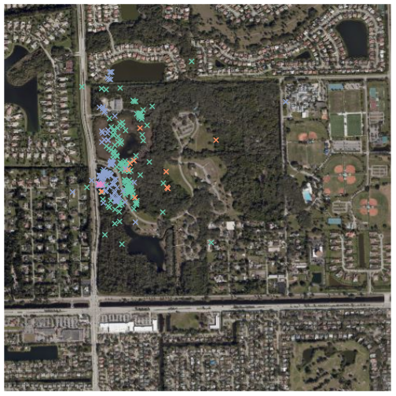

Introducing sftrack: A framework for movement data in R
========================================================
author: Matthew Boone, Rocio Joo, Mathieu Basille
date: 2020-20-07

<style>
.small-code pre code {
  font-size: .93em;
}
</style>

<style>
.smaller-code pre code {
  font-size: .9em;
}
</style>
History of movement data in R
========================================================
<!-- Its too long, but I can cut it once I figure out the best format, and even post the long version as a 'handout'.--->

Movement data - tracking of individuals with axis (x,y,t)

- Proliferation of study in the last 20 years.
- Devices: gps, satellite, accelerometer, light loggers, cameras, telemetry, etc...
- Over 70 R packages on tracking alone \*\*.

\*\*[_*Tracking - Cran Task View (R.Joo, M.Boone, M.Sumner, M.Basille*_)](https://cran.r-project.org/web/views/Tracking.html)

***


R Landscape
========================================================

- Packages to tackle every sensor and analysis combination.
- However there is little overlap between classes and structure.
- Collaboration remains low outside of the core packages

\*\*Joo, R., Boone, M.E., Clay T.A., Patrick S.C., Clusella-Trullas, S., Basille, M. [_*Navigating through the R packages for movement.*_](https://besjournals.onlinelibrary.wiley.com/doi/epdf/10.1111/1365-2656.13116), (doi: 10.1111/1365-2656.13116)

***


Need for a new defining class
========================================================

- Many classes to work with depending on the sensor, data, or analysis.
- Most methods written in S4 which provides limited flexibility for user.
- Additionally documentation of methods for each class remains limited
- Adding to inefficiencies for users and potential developers. (time = less research)


***


`sf` package (Edzer, P. 2018)
========================================================


`sf` 
========================================================

- Moved back to S3 methods, implementing the simple features standard (ISO 19125-1:2004)
- Data is done inside a data.frame. Tibble ready, pipeable, and contains ggplot functions.
- It just plain works.

***


Goals for `sftrack`
========================================================

Over-arching goals
- Build a tracking framework in R that will be accepted by the community.
- Increase the buy in by developers so they develop the framework.

Technical qualities
 - Seamless integration with `sf` (work like an `sf` object because it is one.)
 - Easy for users to understand and modify. 
 - Hierarchical grouping structure
 - No loss conversion between movement models and interclass conversion between packages.
 - Transparent methods and documentation for users and developers.
 
 

Goals for `sftrack`
========================================================
type: prompt

**Our goals are not to replace any of these existing packages. But to create a class that is flexible enough
to be used by all these packages.**


History of `sftrack`
========================================================
- Call for use cases at the end of 2019
- Began coding beginning of 2020.
- Developed current framework in Spring 2020 and release version on CRAN shortly
- We are at the stage now were we need user input to move forward

Format of an `sftrack`
========================================================
class: small-code

Requirements for an sftrack object
- sf geometry column
- a grouping class with 'id' (we're currently calling a burst) 
- time (as.POSIXct or integer)
Optional
- error column (no specific details yet)


```
Sftrack with 6 features and 12 fields (3 empty geometries) 
Geometry : "geometry" (XY, crs: NA) 
Timestamp : "timestamp" (POSIXct in UTC) 
Burst : "burst" (*id*) 
-------------------------------
  sensor_code   utc_date utc_time latitude longitude height hdop vdop fix
1        CJ11 2019-01-19 00:02:30       NA        NA     NA  0.0  0.0  NO
2        CJ11 2019-01-19 01:02:30 26.06945 -80.27906      7  6.2  3.2  2D
3        CJ11 2019-01-19 02:02:30       NA        NA     NA  0.0  0.0  NO
4        CJ11 2019-01-19 03:02:30       NA        NA     NA  0.0  0.0  NO
5        CJ11 2019-01-19 04:02:30 26.06769 -80.27431    858  5.1  3.2  2D
6        CJ11 2019-01-19 05:02:30 26.06867 -80.27930    350  1.9  3.2  3D
            timestamp      burst                   geometry
1 2019-01-19 00:02:30 (id: CJ11)                POINT EMPTY
2 2019-01-19 01:02:30 (id: CJ11) POINT (-80.27906 26.06945)
3 2019-01-19 02:02:30 (id: CJ11)                POINT EMPTY
4 2019-01-19 03:02:30 (id: CJ11)                POINT EMPTY
5 2019-01-19 04:02:30 (id: CJ11) POINT (-80.27431 26.06769)
6 2019-01-19 05:02:30 (id: CJ11)  POINT (-80.2793 26.06867)
```


Format of an `sftrack` - Class models
========================================================
class: small-code

- `sftrack` - standard point class, POINT geometry  
- `sftraj` - step model class :  GEOMETRY(LINESTRING & POINTs)
  - Linear interpolation from t1 -> t2


```
Sftraj with 6 features and 12 fields (3 empty geometries) 
Geometry : "geometry" (XY, crs: NA) 
Timestamp : "timestamp" (POSIXct in UTC) 
Burst : "burst" (*id*) 
-------------------------------
  sensor_code   utc_date utc_time latitude longitude height hdop vdop fix
1        CJ11 2019-01-19 00:02:30       NA        NA     NA  0.0  0.0  NO
2        CJ11 2019-01-19 01:02:30 26.06945 -80.27906      7  6.2  3.2  2D
3        CJ11 2019-01-19 02:02:30       NA        NA     NA  0.0  0.0  NO
4        CJ11 2019-01-19 03:02:30       NA        NA     NA  0.0  0.0  NO
5        CJ11 2019-01-19 04:02:30 26.06769 -80.27431    858  5.1  3.2  2D
6        CJ11 2019-01-19 05:02:30 26.06867 -80.27930    350  1.9  3.2  3D
            timestamp      burst                       geometry
1 2019-01-19 00:02:30 (id: CJ11)                    POINT EMPTY
2 2019-01-19 01:02:30 (id: CJ11)     POINT (-80.27906 26.06945)
3 2019-01-19 02:02:30 (id: CJ11)                    POINT EMPTY
4 2019-01-19 03:02:30 (id: CJ11)                    POINT EMPTY
5 2019-01-19 04:02:30 (id: CJ11) LINESTRING (-80.27431 26.06...
6 2019-01-19 05:02:30 (id: CJ11) LINESTRING (-80.2793 26.068...
```


`sftrack` in the data process
========================================================
class: small-code
`sftrack` can help at multiple points in the data process:


`sftrack` in the data process - Reading/Inputting
========================================================
class: small-code
##### Creating timestamp


```r
data('raccoon')

head(raccoon)
```

```
  sensor_code   utc_date utc_time latitude longitude height hdop vdop fix
1        CJ11 2019-01-19 00:02:30       NA        NA     NA  0.0  0.0  NO
2        CJ11 2019-01-19 01:02:30 26.06945 -80.27906      7  6.2  3.2  2D
3        CJ11 2019-01-19 02:02:30       NA        NA     NA  0.0  0.0  NO
4        CJ11 2019-01-19 03:02:30       NA        NA     NA  0.0  0.0  NO
5        CJ11 2019-01-19 04:02:30 26.06769 -80.27431    858  5.1  3.2  2D
6        CJ11 2019-01-19 05:02:30 26.06867 -80.27930    350  1.9  3.2  3D
```
###### Create timestamps

```r
library(lubridate)
raccoon$timestamp <- ymd_hms(paste(raccoon$utc_date, raccoon$utc_time))
```

##### Create an sftrack

```r
my_sftrack <- as_sftrack(raccoon, burst = 'sensor_code', coords = c('longitude','latitude'), time = 'timestamp', error = 'hdop')
```

`sftrack` in the data process 
========================================================
class: smaller-code
Troubleshooting inputs  
Duplicated time stamps

```r
raccoon$timestamp[1] <- raccoon$timestamp[2]
try(as_sftrack(raccoon, burst = 'sensor_code', coords = c('longitude','latitude'), time = 'timestamp'))
```

```
Error in dup_timestamp(time = data[[time_col]], x = burst) : 
  bursts: CJ11 have duplicated time stamps
```

Identify duplicated group/timestamps

```r
which_duplicated(raccoon, burst = c(id='sensor_code'), time = 'timestamp')
```

```
  burst                time which_row
1  CJ11 2019-01-19 01:02:30         1
2  CJ11 2019-01-19 01:02:30         2
```

```r
raccoon <- raccoon[-2,]
```

Additionally will check for inappropriate NAs in coordinates and grouping categories (by default), and turn zero coordinates into NAs (`zeroNA = TRUE`)

`sftrack` in the data process - grouping
========================================================
class: small-code

- Name pending
- Grouping class that can be linear or hierarchical.
- Dynamically switch between 'active' groups
- Readable and accessible as a list or with `sftrack` functions.


```r
raccoon$month <- month(raccoon$timestamp)
my_sftrack <- as_sftrack(raccoon, burst = c(id='sensor_code', month = 'month'), coords = c('longitude','latitude'), time = 'timestamp', active_burst = 'id', crs= 'EPSG:4326')
head(my_sftrack)
```

```
Sftrack with 6 features and 13 fields (3 empty geometries) 
Geometry : "geometry" (XY, crs: EPSG:4326) 
Timestamp : "timestamp" (POSIXct in UTC) 
Burst : "burst" (*id*) 
-------------------------------
  sensor_code   utc_date utc_time latitude longitude height hdop vdop fix
1        CJ11 2019-01-19 00:02:30       NA        NA     NA  0.0  0.0  NO
3        CJ11 2019-01-19 02:02:30       NA        NA     NA  0.0  0.0  NO
4        CJ11 2019-01-19 03:02:30       NA        NA     NA  0.0  0.0  NO
5        CJ11 2019-01-19 04:02:30 26.06769 -80.27431    858  5.1  3.2  2D
6        CJ11 2019-01-19 05:02:30 26.06867 -80.27930    350  1.9  3.2  3D
7        CJ11 2019-01-19 06:02:30 26.06962 -80.27908     11  2.3  4.5  3D
            timestamp month                burst
1 2019-01-19 01:02:30     1 (id: CJ11, month: 1)
3 2019-01-19 02:02:30     1 (id: CJ11, month: 1)
4 2019-01-19 03:02:30     1 (id: CJ11, month: 1)
5 2019-01-19 04:02:30     1 (id: CJ11, month: 1)
6 2019-01-19 05:02:30     1 (id: CJ11, month: 1)
7 2019-01-19 06:02:30     1 (id: CJ11, month: 1)
                    geometry
1                POINT EMPTY
3                POINT EMPTY
4                POINT EMPTY
5 POINT (-80.27431 26.06769)
6  POINT (-80.2793 26.06867)
7 POINT (-80.27908 26.06962)
```

`sftrack` in the data process - grouping
========================================================
class: small-code

Active Burst  

```r
active_burst(my_sftrack)
```

```
[1] "id"
```

```r
plot(my_sftrack, axes = TRUE)
```


`sftrack` in the data process - grouping
========================================================
class: small-code

Changing group 

```r
#change active_burst
active_burst(my_sftrack) <- c('id','month')
plot(my_sftrack, axes = TRUE)
```


`sftrack` in the data process - Calculate step metrics
========================================================
class: smaller-code

Calculate steps

```r
#change active_burst
step_calc <- step_metrics(my_sftrack)[5:10,]
summary(step_calc)
```

```
       dx                dy               dist               dt       
 Min.   :-14.464   Min.   :-22.513   Min.   :  0.000   Min.   : 3574  
 1st Qu.: -2.924   1st Qu.:-10.214   1st Qu.:  1.409   1st Qu.: 3581  
 Median : 52.779   Median : -5.837   Median : 10.669   Median : 3600  
 Mean   : 79.707   Mean   : -9.519   Mean   : 59.356   Mean   : 8396  
 3rd Qu.:135.409   3rd Qu.: -5.142   3rd Qu.: 84.197   3rd Qu.: 3620  
 Max.   :227.733   Max.   : -3.891   Max.   :227.766   Max.   :32400  
 NA's   :2         NA's   :2                                          
   abs_angle         speed            sftrack_id       
 Min.   :1.588   Min.   :0.0000000   Length:6          
 1st Qu.:1.734   1st Qu.:0.0003942   Class :character  
 Median :2.380   Median :0.0029846   Mode  :character  
 Mean   :2.665   Mean   :0.0164976                     
 3rd Qu.:3.311   3rd Qu.:0.0233958                     
 Max.   :4.312   Max.   :0.0632860                     
 NA's   :2                                             
```

Filter out points


```r
my_sftrack <- my_sftrack[step_calc$speed<100,]
```

`sftrack` in the data process - Plot points
========================================================
class: small-code


```r
library(OpenStreetMap)
map1 <- openmap(c(26.08,-80.285),c(26.06,-80.265),zoom=15, type='bing')
map1 <- openproj(map1)
plot(map1)
plot(my_sftrack, add= T,pch=4,lwd=2)
```



`sftrack` in the data process - Subset points
========================================================
class: small-code


Core components yet to be installed
========================================================
- tibble methods
- complete ggplot (limited set currently)
- Standards, DBS connections? WKT?

Needs work and input
- base plot functions need to be expanding to link completely with `sf` plot methods.
- Names

How can you help?
========================================================
- We've gathered usecases, but appreciate more.
- Please go to sftrack github and submit use cases ([github.com/mablab/sftrack](https://github.com/mablab/sftrack)).
- A version should be up on CRAN soon. 
- We need your input on many technical issues and the framework. (Perhaps will have issues up before conference)

