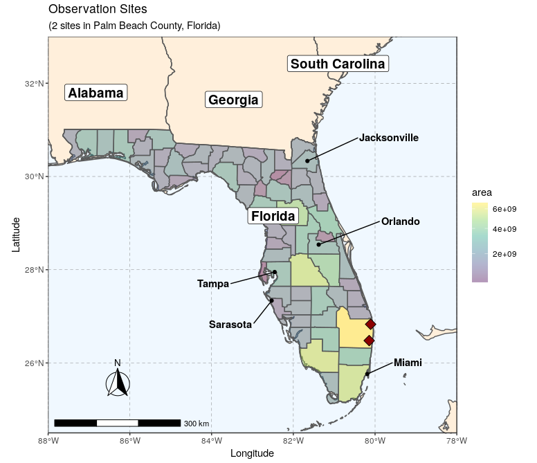
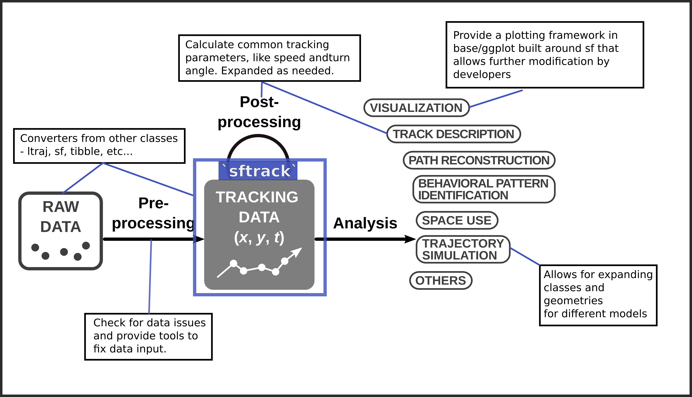
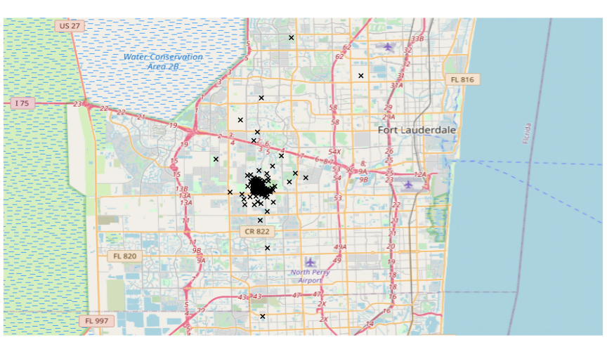
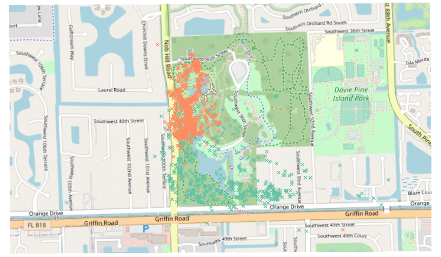

Introducing sftrack: A framework for movement data in R
========================================================
author: Matthew Boone, Rocio Joo, Mathieu Basille
date: Ecology Society of America conference 2020
css: esa.css
width: 1440
height: 900
History of movement data
========================================================
type: section
left: 40%
<br>
- Tracking data 
 + discrete points
 + home range analysis, resource selection functions, etc...
- Movement data
 + series of steps
 + Hidden-Markov Models, step selection functions, etc...

<!-- Important to understand that there could be gaps anywhere in the data -->
<!-- Maybe change graph to include missing points-->
***

<div align="center" style="margin-top: 50px">

</div>

History of movement data
========================================================
type: section
left: 45%
<br>

- Proliferation of study in the last 20 years.
- Devices: gps, satellite, accelerometer, light loggers, cameras, telemetry, etc...
- Data sizes increasing rapidly with more sensors

<div class='footer' style="font-size:15px; line-height:15px;">
<sup style="font-size:50%;">fig</sup>Joo, R., Picardi, S., Boone, M., Clay, T., Patrick, S., Romero-Romero, V., Basille, M., A Decade of Movement Ecology, 2020.<a href='https://arxiv.org/abs/2006.00110v1'> arXiv:2006.00110 </a>    
</div>
***


History of Movement Data in R
========================================================
type: section
title: FALSE
<h2 align="center"> Software used in the field of Movement Ecology</h2>
<div align="center" style="margin-top:0px">

</div>

<div class='footer' style="font-size:15px; line-height:15px;">
<sup style="font-size:50%;">1</sup>Joo, R., Picardi, S., Boone, M., Clay, T., Patrick, S., Romero-Romero, V., Basille, M., A Decade of Movement Ecology, 2020.<a href='https://arxiv.org/abs/2006.00110v1'> arXiv:2006.00110 </a>
</div>

R Landscape
========================================================
type: section
title: FALSE

<!--Packages to tackle every sensor and analysis combination.
- However there is little overlap between classes and structure.
- Collaboration remains low outside of the core packages --->
<h2 align="center"> Depends and Suggests of movement packages in R </h2>
<div align="center" style="margin-top:0px">

</div>

<div class='footer' style="font-size:15px; line-height:15px">
 <sup style="font-size:50%;">fig</sup>Joo, R., Boone, M.E., Clay T.A., Patrick S.C., Clusella-Trullas, S., Basille, M. Navigating through the R packages for movement, Journal of Animal Ecology. 2019. <a href='https://besjournals.onlinelibrary.wiley.com/doi/epdf/10.1111/1365-2656.13116'>doi: 10.1111/1365-2656.13116</a>
</div>

Need for a new defining class
========================================================
type: section
left: 40%

- Many classes to work with.
- Methods written in S4.
- Documentation of classes and methods can be limited.
- more time = less research


<!-- - Many classes to work with depending on the sensor, data, or analysis.
- Most methods written in S4 which provides limited flexibility for user.
- Additionally documentation of methods for each class remains limited.
- Adding to inefficiencies for users and potential developers. (time = less research). -->


`sf` package 
========================================================
type: section
left: 45%

<div class='footer' style="font-size:15px; line-height:15px">
Pebesma, E. Simple Features for R: Standardized Support for Spatial Vector Data, The R Journal. 2019. <a href='https://besjournals.onlinelibrary.wiley.com/doi/epdf/10.1111/1365-2656.13116'>doi: 10.32614/RJ-2018-009</a>
</div>
<h2 align = right>simple features framework ---></h2>

***
<h2> easy mapping and spatial analysis </h2>


Goals for `sftrack`
========================================================
type: section

Build a movement framework that the community will buy into

Flexible enough to contain ever expanding structures of movement models

Make methods and documentation transparent

Fully compatible with sf, tidyverse, and ggplot

Goals for `sftrack`
========================================================
type: section



Goals for `sftrack`
========================================================
type: prompt
**Our goals are not to replace any of these existing packages. But to create a class that is flexible enough
to be used by all these packages.**
<div align="center">

</div>
<!--Call for use cases at the end of 2019

##Began coding beginning of 2020.

##Developed current framework in Spring 2020

##We are at the stage now were we need user input to move forward-->

Format of an `sftrack`
========================================================
type: section
class: small-code
left:30%
<br>
- S3, data.frame model
- sf geometry column
- grouping class with a required 'id' field
- time (as.POSIXct or integer)  
- error column (optional)

****

<div align="center" style="margin-top: 100px">

</div>

<!--

```
Sftrack with 445 features and 8 fields (168 empty geometries) 
Geometry : "geometry" (XY, crs: WGS 84) 
Timestamp : "timestamp" (POSIXct in UTC) 
Burst : "burst" (*id*) 
-------------------------------
   animal_id           timestamp height hdop vdop fix         burst                   geometry
1    TTP-058 2019-01-19 00:02:30     NA  0.0  0.0  NO (id: TTP-058)                POINT EMPTY
2    TTP-058 2019-01-19 01:02:30      7  6.2  3.2  2D (id: TTP-058) POINT (-80.27906 26.06945)
3    TTP-058 2019-01-19 02:02:30     NA  0.0  0.0  NO (id: TTP-058)                POINT EMPTY
4    TTP-058 2019-01-19 03:02:30     NA  0.0  0.0  NO (id: TTP-058)                POINT EMPTY
5    TTP-058 2019-01-19 04:02:30    858  5.1  3.2  2D (id: TTP-058) POINT (-80.27431 26.06769)
6    TTP-058 2019-01-19 05:02:30    350  1.9  3.2  3D (id: TTP-058)  POINT (-80.2793 26.06867)
7    TTP-058 2019-01-19 06:02:30     11  2.3  4.5  3D (id: TTP-058) POINT (-80.27908 26.06962)
8    TTP-058 2019-01-19 07:02:04      9  2.7  3.9  3D (id: TTP-058) POINT (-80.27902 26.06963)
9    TTP-058 2019-01-19 08:02:30     NA  0.0  0.0  NO (id: TTP-058)                POINT EMPTY
10   TTP-058 2019-01-19 17:02:30     NA  2.0  3.3  3D (id: TTP-058)   POINT (-80.279 26.06982)
11   TTP-058 2019-01-19 18:02:05      8  4.2  2.5  3D (id: TTP-058) POINT (-80.27894 26.06969)
12   TTP-058 2019-01-19 19:02:04     -3  0.9  1.5  3D (id: TTP-058)  POINT (-80.2789 26.07174)
```
-->

<!--
`sftrack` : POINT geometry  

`sftraj` : GEOMETRY(LINESTRING & POINT)

NAs may exist at any time segment -->

`sftrack` - sftraj class
========================================================
type: section
class: small-code


`sftrack` - reading & inputting
========================================================
type: section
class: small-code

```
  animal_id          timestamp           longitude         latitude         fix           
 Length:17447       Length:17447       Min.   :-80.89   Min.   : 0.00   Length:17447      
 Class :character   Class :character   1st Qu.:-80.28   1st Qu.: 0.00   Class :character  
 Mode  :character   Mode  :character   Median :-80.27   Median :26.07   Mode  :character  
                                       Mean   :-54.89   Mean   :17.83                     
                                       3rd Qu.:  0.00   3rd Qu.:26.07                     
                                       Max.   :  0.00   Max.   :27.89                     
```

```
devtools::install_github("mablab/sftrack")
raccoon <- read.csv('my_data/raccoon_data.csv')

summary(raccoon)
```

Prepare

```r
library(lubridate)
raccoon$timestamp <- ymd_hms(raccoon$timestamp)
# lat/long crs
wsg <- 'EPSG:4326'
```

Create

```r
my_sftrack <- as_sftrack(raccoon, burst = 'animal_id', time = 'timestamp', 
                         coords = c('longitude', 'latitude'), crs=wsg, zeroNA = TRUE)
```

`sftrack` - plotting works with `sf` methods
========================================================
type: section
class: small-code

```r
plot(my_sftrack, axes = T, graticule = TRUE, pch = 4, lwd=3.8)
```


`sftrack` - manipulating like a data.frame
========================================================
type: section
class: small-code


```r
my_sftrack <- my_sftrack[c('TTP-058','TTP-041'),]
print(my_sftrack, n_row=12)
```

```
Sftrack with 4769 features and 7 fields (2236 empty geometries) 
Geometry : "geometry" (XY, crs: WGS 84) 
Timestamp : "timestamp" (POSIXct in UTC) 
Burst : "burst" (*id*) 
-------------------------------
      animal_id           timestamp longitude latitude fix         burst                   geometry
10891   TTP-041 2019-01-15 17:02:30   0.00000  0.00000  NO (id: TTP-041)                POINT EMPTY
3351    TTP-041 2019-01-16 17:02:30 -80.27812 26.06610  3D (id: TTP-041)  POINT (-80.27812 26.0661)
3352    TTP-041 2019-01-17 17:02:30 -80.27830 26.06561  3D (id: TTP-041)  POINT (-80.2783 26.06561)
3353    TTP-041 2019-01-18 17:02:30 -80.27835 26.06566  3D (id: TTP-041) POINT (-80.27835 26.06566)
3354    TTP-041 2019-01-19 00:02:30 -80.27531 26.06607  3D (id: TTP-041) POINT (-80.27531 26.06607)
3355    TTP-041 2019-01-19 01:02:05 -80.27620 26.06573  3D (id: TTP-041)  POINT (-80.2762 26.06573)
3356    TTP-041 2019-01-19 02:02:05 -80.27636 26.06859  3D (id: TTP-041) POINT (-80.27636 26.06859)
10892   TTP-041 2019-01-19 03:02:30   0.00000  0.00000  NO (id: TTP-041)                POINT EMPTY
10893   TTP-041 2019-01-19 04:02:30   0.00000  0.00000  NO (id: TTP-041)                POINT EMPTY
10894   TTP-041 2019-01-19 05:02:30   0.00000  0.00000  NO (id: TTP-041)                POINT EMPTY
15584   TTP-041 2019-01-19 06:02:30 -80.27873 26.06819  2D (id: TTP-041) POINT (-80.27873 26.06819)
10895   TTP-041 2019-01-19 07:02:30   0.00000  0.00000  NO (id: TTP-041)                POINT EMPTY
```

`sftrack` - manipulating like a data.frame
========================================================
type: section
class: small-code
left: 30%
<br>

```r
library(OpenStreetMap)

# Get bounding box from sf geometry
bbox <- st_bbox(my_sftrack)
lower_right <- bbox[c(2,3)] + c(-0.01,0.2)
upper_left <- bbox[c(4,1)] + c(0.01,-0.2)

# download open street map
map <- openmap(upper_left,lower_right,
               zoom=11, type='osm')

# project map
map <- openproj(map)
```

***
<br>

```r
plot(map)
plot(my_sftrack, add= T, pch=4, lwd=2, col = 'black')
```



`sftrack` - acts just like an 'sf' object
========================================================
type: section
class: small-code

<br>

```r
utm_17 <- '+proj=utm +zone=17 +ellps=WGS84 +datum=WGS84 +units=m +no_defs'
my_sftrack <- st_transform(my_sftrack, crs = utm_17)

# Make a polygon within study
poly_pts <- list(
  rbind(
  c(572300, 2883500),
  c(572600, 2883500),
  c(572600, 2883700),
  c(572300, 2883700),
  c(572300, 2883500)
  )
)
polygon <- st_sfc(st_polygon(poly_pts), crs=utm_17)
```

***
<br>

```r
# What points are within a polygon?

plot(polygon, axes= T, graticule = TRUE, expandBB = c(1.5,1.5,1.5,1.5), col =sf.colors(alpha=0.2))
plot(my_sftrack, add =T)
```


`sftrack` - acts just like an 'sf' object
========================================================
type: section
class: small-code

<br>

```r
answer <- st_within(my_sftrack, polygon, sparse=FALSE)
sub_sftrack <- my_sftrack[answer, ]
head(sub_sftrack)
```

```
Sftrack with 6 features and 7 fields (0 empty geometries) 
Geometry : "geometry" (XY, crs: +proj=utm +zone=17 +ellps=WGS84 +datum=WGS84 +units=m +no_defs) 
Timestamp : "timestamp" (POSIXct in UTC) 
Burst : "burst" (*id*) 
-------------------------------
      animal_id           timestamp longitude latitude fix         burst                 geometry
3382    TTP-041 2019-01-24 02:02:09 -80.27637 26.07026  3D (id: TTP-041) POINT (572377.1 2883665)
15601   TTP-041 2019-01-28 20:02:30 -80.27576 26.06974  2D (id: TTP-041) POINT (572438.2 2883608)
3425    TTP-041 2019-02-03 19:02:14 -80.27701 26.07041  3D (id: TTP-041) POINT (572313.6 2883681)
3426    TTP-041 2019-02-03 20:02:08 -80.27466 26.07010  3D (id: TTP-041) POINT (572548.8 2883649)
3482    TTP-041 2019-02-13 02:02:09 -80.27630 26.06926  3D (id: TTP-041) POINT (572385.2 2883555)
17035   TTP-041 2019-02-22 02:02:20 -80.27497 26.06999  3D (id: TTP-041) POINT (572517.3 2883636)
```

`sftrack` - calculate common parameters
========================================================
type: section
class: small-code


```r
step_calc <- step_metrics(my_sftrack)
head(step_calc)
```

```
          dx         dy       dist    dt  abs_angle        speed                  sftrack_id
1         NA         NA         NA 86400         NA           NA TTP-041_2019-01-15 17:02:30
2 -18.008768 -53.593639  56.538428 86400 -1.8949668 6.543800e-04 TTP-041_2019-01-16 17:02:30
3  -4.727009   4.625484   6.613601 86400  2.3670495 7.654631e-05 TTP-041_2019-01-17 17:02:30
4 303.425593  47.756375 307.160807 25200  0.1561101 1.218892e-02 TTP-041_2019-01-18 17:02:30
5 -89.014047 -38.261403  96.888779  3575 -2.7356334 2.710176e-02 TTP-041_2019-01-19 00:02:30
6 -17.864152 316.988342 317.491318  3600  1.6270926 8.819203e-02 TTP-041_2019-01-19 01:02:05
```

```r
summary(step_calc)
```

```
       dx                  dy                 dist                dt          abs_angle      
 Min.   :-9821.837   Min.   :-9016.561   Min.   :    0.00   Min.   :  872   Min.   :-3.1390  
 1st Qu.:  -55.167   1st Qu.:  -75.025   1st Qu.:   28.16   1st Qu.: 3584   1st Qu.:-1.5906  
 Median :   -0.312   Median :   -1.547   Median :  125.38   Median : 3600   Median :-0.1664  
 Mean   :  -14.602   Mean   :   -2.238   Mean   :  224.22   Mean   : 5561   Mean   :-0.0418  
 3rd Qu.:   45.378   3rd Qu.:   54.129   3rd Qu.:  288.37   3rd Qu.: 3600   3rd Qu.: 1.5806  
 Max.   : 1700.460   Max.   :14427.086   Max.   :14427.40   Max.   :86400   Max.   : 3.1413  
 NA's   :2793        NA's   :2793        NA's   :2793       NA's   :2       NA's   :2794     
     speed         sftrack_id       
 Min.   :0.0000   Length:4769       
 1st Qu.:0.0112   Class :character  
 Median :0.0409   Mode  :character  
 Mean   :0.0806                     
 3rd Qu.:0.0901                     
 Max.   :7.7028                     
 NA's   :2793                       
```

`sftrack` - filtering
========================================================
type: section
class: small-code
left:40%
<br>

```r
# Filter out by travel distance

my_sftrack <- my_sftrack[!is.na(step_calc$dist) &step_calc$dist<200,]
```

```r
library(OpenStreetMap)
map_zoom <- 
  openmap(c(26.078,-80.292),c(26.062,-80.262),
          zoom=15, type='osm')
# project to UTM 17
map_zoom <- openproj(map_zoom, utm_17)
```

***
<br>

```r
plot(map_zoom)
plot(my_sftrack, add= T, pch=4, lwd=2)
```



`sftrack` - sftraj class
========================================================
type: section
class: small-code

<br>

```r
my_sftraj <- as_sftraj(my_sftrack)
head(my_sftraj)
```

```
Sftraj with 6 features and 7 fields (0 empty geometries) 
Geometry : "geometry" (XY, crs: +proj=utm +zone=17 +ellps=WGS84 +datum=WGS84 +units=m +no_defs) 
Timestamp : "timestamp" (POSIXct in UTC) 
Burst : "burst" (*id*) 
-------------------------------
     animal_id           timestamp longitude latitude fix         burst
3351   TTP-041 2019-01-16 17:02:30 -80.27812 26.06610  3D (id: TTP-041)
3352   TTP-041 2019-01-17 17:02:30 -80.27830 26.06561  3D (id: TTP-041)
3354   TTP-041 2019-01-19 00:02:30 -80.27531 26.06607  3D (id: TTP-041)
3358   TTP-041 2019-01-19 20:02:17 -80.27875 26.07387  3D (id: TTP-041)
3360   TTP-041 2019-01-19 22:02:08 -80.27848 26.07533  3D (id: TTP-041)
3366   TTP-041 2019-01-21 05:02:30 -80.27702 26.06576  3D (id: TTP-041)
                           geometry
3351 LINESTRING (572205.1 288320...
3352 LINESTRING (572187.1 288315...
3354 LINESTRING (572485.8 288320...
3358 LINESTRING (572137.3 288406...
3360 LINESTRING (572163.3 288422...
3366 LINESTRING (572314.8 288316...
```

***
<br>

```r
plot(my_sftraj, graticule = TRUE, key.pos=4, main = 'Tree Tops Park Raccoons')
```


`sftrack` - dynamic grouping
========================================================
type: section
class: small-code
left:50%
<br>

```r
data('raccoon',package='sftrack')

raccoon$timestamp <- ymd_hms(raccoon$timestamp)

# create a  new month category
raccoon$month <- month(raccoon$timestamp)

burst = c(id = 'animal_id', month = 'month')

my_sftraj <- as_sftraj(raccoon, burst = burst, 
                       time = 'timestamp', coords = c('longitude', 'latitude'),
                       crs=wsg, zeroNA = TRUE)

# Check out what group is active
active_burst(my_sftraj)
```

```
[1] "id"    "month"
```

***
<br>

```r
plot(my_sftraj, graticule = TRUE)
```


`sftrack` - dynamic grouping
========================================================
type: section
class: small-code

```r
active_burst(my_sftraj) <- 'id'
plot(my_sftraj, graticule = TRUE)
```


Core components yet to be installed
========================================================
type: section
<br>
- tibble methods
- expanded ggplot methods (limited currently)
- base plot functions need to be expanding to link completely with `sf` plot methods.
- Consensus on naming 
- Standards, DBS connections? WKT?

How can you help?
========================================================
type: section
<br>
- Install and try it out! [github.com/mablab/sftrack](https://github.com/mablab/sftrack)
- Need input from users + developers
- Need feedback on final specifications of the framework
 - specifically on `sftraj` class and grouping structure

***


Thank You
========================================================
type: section

<br>
<br>
<br>
<br>
<div align="left" style="margin-top: 150px">

</div>
<small>
@birderboone  
github/birderboone  
mablab.org  
</small>

***


