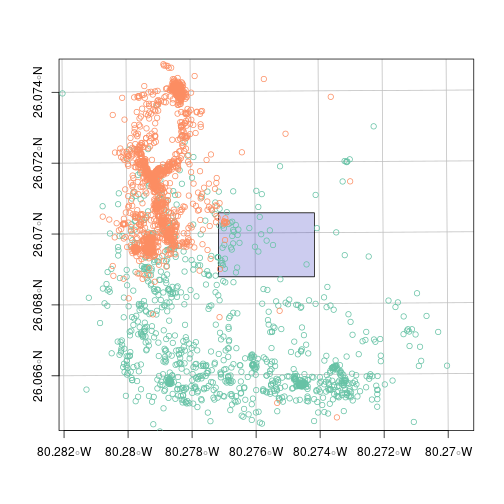

Introducing sftrack: A framework for movement data in R
========================================================
author: Matthew Boone, Rocio Joo, Mathieu Basille
date: 2020-20-07
css: esa.css
width: 1440
height: 900
History of movement data in R
========================================================
type: section
left: 45%
<!-- Its too long, but I can cut it once I figure out the best format, and even post the long version as a 'handout'.--->
<br>
- tracking of individuals with axis (x,y,t)
- Proliferation of study in the last 20 years.
- Devices: gps, satellite, accelerometer, light loggers, cameras, telemetry, etc...
- Over 70 R packages on tracking alone<sup style='font-size:10px;'>1</i>


<div class='footer' style="font-size:15px; line-height:15px;">
<sup style="font-size:50%;">1</sup> Tracking - Cran Task View. R.Joo, M.Boone, M.Sumner, M.Basille <b>(https://cran.r-project.org/web/views/Tracking.html)</b><br>
<sup style="font-size:50%;">fig</sup>Joo, R., Picardi, S., Boone, M., Clay, T., Patrick, S., Romero-Romero, V., Basille, M., A Decade of Movement Ecology, 2020.<a href='https://arxiv.org/abs/2006.00110v1'> arXiv:2006.00110 </a>    
</div>
***


R Landscape
========================================================
type: section
title: TRUE
left: 40%
<br>
- Packages to tackle every sensor and analysis combination.
- However there is little overlap between classes and structure.
- Collaboration remains low outside of the core packages<sup style='font-size:10px;'>1</i>

<div class='footer' style="font-size:15px; line-height:15px;">

<sup style="font-size:50%;">1</sup>Joo, R., Boone, M.E., Clay T.A., Patrick S.C., Clusella-Trullas, S., Basille, M. Navigating through the R packages for movement, Journal of Animal Ecology. 2019. <a href='https://besjournals.onlinelibrary.wiley.com/doi/epdf/10.1111/1365-2656.13116'>doi: 10.1111/1365-2656.13116</a><br>
 


</div>

***
Depends and Suggests of movement packages in R


Need for a new defining class
========================================================
type: section
left: 40%
<br>
- Many classes to work with depending on the sensor, data, or analysis.
- Most methods written in S4 which provides limited flexibility for user.
- Additionally documentation of methods for each class remains limited
- Adding to inefficiencies for users and potential developers. (time = less research)
***
<br>


`sf` package (Edzer, P. 2018)
========================================================
type: section
left: 40%
<br>
- Moved back to S3 methods, implementing the simple features standard (ISO 19125-1:2004)
- Data is done inside a data.frame. Tibble ready, pipeable, and contains ggplot functions.
- It just plain works.

***
<br>


Goals for `sftrack`
========================================================
type: section
left:40%
<br>
- Build a movement framework that the community will buy into
- Make methods and documentation transparent
 
Goals for `sftrack`
========================================================
type: prompt
**Our goals are not to replace any of these existing packages. But to create a class that is flexible enough
to be used by all these packages.**
<div align="center">

</div>
History of `sftrack`
========================================================
type: section
- Call for use cases at the end of 2019
- Began coding beginning of 2020.
- Developed current framework in Spring 2020 and release version on CRAN shortly
- We are at the stage now were we need user input to move forward

Format of an `sftrack`
========================================================
type: section
class: small-code

Requirements for an sftrack object
- sf geometry column
- a grouping class with 'id' (we're currently calling a burst) 
- time (as.POSIXct or integer)
Optional
- error column (no specific details yet)

***

```
Sftrack with 6 features and 12 fields (3 empty geometries) 
Geometry : "geometry" (XY, crs: NA) 
Timestamp : "timestamp" (POSIXct in UTC) 
Burst : "burst" (*id*) 
-------------------------------
  sensor_code   utc_date utc_time latitude longitude height hdop vdop fix
1        CJ11 2019-01-19 00:02:30       NA        NA     NA  0.0  0.0  NO
2        CJ11 2019-01-19 01:02:30 26.06945 -80.27906      7  6.2  3.2  2D
3        CJ11 2019-01-19 02:02:30       NA        NA     NA  0.0  0.0  NO
4        CJ11 2019-01-19 03:02:30       NA        NA     NA  0.0  0.0  NO
5        CJ11 2019-01-19 04:02:30 26.06769 -80.27431    858  5.1  3.2  2D
6        CJ11 2019-01-19 05:02:30 26.06867 -80.27930    350  1.9  3.2  3D
            timestamp      burst                   geometry
1 2019-01-19 00:02:30 (id: CJ11)                POINT EMPTY
2 2019-01-19 01:02:30 (id: CJ11) POINT (-80.27906 26.06945)
3 2019-01-19 02:02:30 (id: CJ11)                POINT EMPTY
4 2019-01-19 03:02:30 (id: CJ11)                POINT EMPTY
5 2019-01-19 04:02:30 (id: CJ11) POINT (-80.27431 26.06769)
6 2019-01-19 05:02:30 (id: CJ11)  POINT (-80.2793 26.06867)
```


Format of an `sftrack` - Class models
========================================================
type: section
class: small-code

- `sftrack` - standard point class, POINT geometry  
- `sftraj` - step model class :  GEOMETRY(LINESTRING & POINTs)
  - Linear interpolation from t1 -> t2
  
***

```
Sftraj with 6 features and 12 fields (3 empty geometries) 
Geometry : "geometry" (XY, crs: NA) 
Timestamp : "timestamp" (POSIXct in UTC) 
Burst : "burst" (*id*) 
-------------------------------
  sensor_code   utc_date utc_time latitude longitude height hdop vdop fix
1        CJ11 2019-01-19 00:02:30       NA        NA     NA  0.0  0.0  NO
2        CJ11 2019-01-19 01:02:30 26.06945 -80.27906      7  6.2  3.2  2D
3        CJ11 2019-01-19 02:02:30       NA        NA     NA  0.0  0.0  NO
4        CJ11 2019-01-19 03:02:30       NA        NA     NA  0.0  0.0  NO
5        CJ11 2019-01-19 04:02:30 26.06769 -80.27431    858  5.1  3.2  2D
6        CJ11 2019-01-19 05:02:30 26.06867 -80.27930    350  1.9  3.2  3D
            timestamp      burst                       geometry
1 2019-01-19 00:02:30 (id: CJ11)                    POINT EMPTY
2 2019-01-19 01:02:30 (id: CJ11)     POINT (-80.27906 26.06945)
3 2019-01-19 02:02:30 (id: CJ11)                    POINT EMPTY
4 2019-01-19 03:02:30 (id: CJ11)                    POINT EMPTY
5 2019-01-19 04:02:30 (id: CJ11) LINESTRING (-80.27431 26.06...
6 2019-01-19 05:02:30 (id: CJ11) LINESTRING (-80.2793 26.068...
```

<!--
`sftrack` in the data process
========================================================
type: section
class: small-code


-->

`sftrack` in the data process - Reading/Inputting
========================================================
type: section
class: small-code
##### Creating timestamp


```r
data('raccoon')

head(raccoon)
```

```
  sensor_code   utc_date utc_time latitude longitude height hdop vdop fix
1        CJ11 2019-01-19 00:02:30       NA        NA     NA  0.0  0.0  NO
2        CJ11 2019-01-19 01:02:30 26.06945 -80.27906      7  6.2  3.2  2D
3        CJ11 2019-01-19 02:02:30       NA        NA     NA  0.0  0.0  NO
4        CJ11 2019-01-19 03:02:30       NA        NA     NA  0.0  0.0  NO
5        CJ11 2019-01-19 04:02:30 26.06769 -80.27431    858  5.1  3.2  2D
6        CJ11 2019-01-19 05:02:30 26.06867 -80.27930    350  1.9  3.2  3D
```
###### Create timestamps

```r
library(lubridate)
raccoon$timestamp <- ymd_hms(paste(raccoon$utc_date, raccoon$utc_time))
```

##### Create an sftrack

```r
my_sftrack <- as_sftrack(raccoon, burst = 'sensor_code', coords = c('longitude','latitude'), time = 'timestamp', error = 'hdop')
```

`sftrack` in the data process 
========================================================
type: section
class: smaller-code
Troubleshooting inputs  
Duplicated time stamps

```r
raccoon$timestamp[1] <- raccoon$timestamp[2]
try(as_sftrack(raccoon, burst = 'sensor_code', coords = c('longitude','latitude'), time = 'timestamp'))
```

```
Error in dup_timestamp(time = data[[time_col]], x = burst) : 
  bursts: CJ11 have duplicated time stamps
```

Identify duplicated group/timestamps

```r
which_duplicated(raccoon, burst = c(id='sensor_code'), time = 'timestamp')
```

```
  burst                time which_row
1  CJ11 2019-01-19 01:02:30         1
2  CJ11 2019-01-19 01:02:30         2
```

```r
raccoon <- raccoon[-2,]
```

Additionally will check for inappropriate NAs in coordinates and grouping categories (by default), and turn zero coordinates into NAs (`zeroNA = TRUE`)

`sftrack` in the data process - grouping
========================================================
type: section
class: small-code
left:40%
<br>
- Name pending
- Grouping class that can be linear or hierarchical.
- Dynamically switch between 'active' groups
- Readable and accessible as a list or with `sftrack` functions.

*** 
<br>

```r
raccoon$month <- month(raccoon$timestamp)
wsg <- 'EPSG:4326'
my_sftrack <- as_sftrack(raccoon, burst = c(id='sensor_code', month = 'month'), coords = c('longitude','latitude'), time = 'timestamp', active_burst = 'id', crs= wsg)
head(my_sftrack)
```

```
Sftrack with 6 features and 13 fields (3 empty geometries) 
Geometry : "geometry" (XY, crs: EPSG:4326) 
Timestamp : "timestamp" (POSIXct in UTC) 
Burst : "burst" (*id*) 
-------------------------------
  sensor_code   utc_date utc_time latitude longitude height hdop vdop fix
1        CJ11 2019-01-19 00:02:30       NA        NA     NA  0.0  0.0  NO
3        CJ11 2019-01-19 02:02:30       NA        NA     NA  0.0  0.0  NO
4        CJ11 2019-01-19 03:02:30       NA        NA     NA  0.0  0.0  NO
5        CJ11 2019-01-19 04:02:30 26.06769 -80.27431    858  5.1  3.2  2D
6        CJ11 2019-01-19 05:02:30 26.06867 -80.27930    350  1.9  3.2  3D
7        CJ11 2019-01-19 06:02:30 26.06962 -80.27908     11  2.3  4.5  3D
            timestamp month                burst
1 2019-01-19 01:02:30     1 (id: CJ11, month: 1)
3 2019-01-19 02:02:30     1 (id: CJ11, month: 1)
4 2019-01-19 03:02:30     1 (id: CJ11, month: 1)
5 2019-01-19 04:02:30     1 (id: CJ11, month: 1)
6 2019-01-19 05:02:30     1 (id: CJ11, month: 1)
7 2019-01-19 06:02:30     1 (id: CJ11, month: 1)
                    geometry
1                POINT EMPTY
3                POINT EMPTY
4                POINT EMPTY
5 POINT (-80.27431 26.06769)
6  POINT (-80.2793 26.06867)
7 POINT (-80.27908 26.06962)
```

`sftrack` in the data process - grouping
========================================================
type: section
class: small-code

Active Burst  

```r
active_burst(my_sftrack)
```

```
[1] "id"
```

```r
plot(my_sftrack, axes = TRUE)
```


`sftrack` in the data process - grouping
========================================================
type: section
class: small-code

Changing group 

```r
#change active_burst
active_burst(my_sftrack) <- c('id','month')
par(mar = c(14, 14, 14, 14))
plot(my_sftrack, axes = TRUE, key.pos=1)
```



`sftrack` in the data process -fully integrated with sf
========================================================
type: section
class: smaller-code


```
Error in UseMethod("as_sftrack", object = data) : 
  no applicable method for 'as_sftrack' applied to an object of class "function"
```
